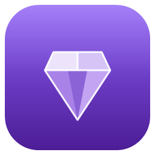

<div align="center">



# Amethyst Launcher

**Современный лаунчер Minecraft с облачными аккаунтами, конструктором сборок, друзьями, скинами и встроенным обходом блокировок.**

[](https://github.com/KinDArs109/AmethystLauncher/releases/latest)
[](https://github.com/KinDArs109/AmethystLauncher/releases)
[](#)

</div>

---

## Возможности

- **Библиотека сборок** — создание, клонирование и запуск инстансов Fabric / Forge / Quilt / Vanilla с раздельными настройками (ОЗУ, Java, аргументы JVM, размер окна).
- **Поиск проектов** — установка модов, ресурспаков, шейдеров и наборов данных прямо из Modrinth с фильтрами и сортировкой, установка в существующую сборку или в новую.
- **Конструктор сборок** — сборка модпака из локальных модов и проектов Modrinth в один клик.
- **Облачные аккаунты** — вход и регистрация с синхронизацией через Supabase.
- **Друзья и статус** — список друзей, онлайн-статус и что запущено прямо сейчас.
- **Скины** — загрузка скина (Steve / Alex) с автоустановкой скин-мода.
- **Поддержка** — обращения в поддержку с перепиской в реальном времени и историей тем.
- **Обход блокировок** — встроенный DPI-обход (zapret) для доступа к Modrinth и облаку у провайдеров с блокировками. UAC запрашивается один раз.
- **Автообновление** — лаунчер сам проверяет обновления при запуске и обновляется в один клик.

## Установка

1. Скачайте **`AmethystLauncher-Setup.exe`** со страницы [Releases](https://github.com/KinDArs109/AmethystLauncher/releases/latest).
2. Запустите установщик — лаунчер установится и создаст ярлык.
3. Дальше лаунчер обновляется сам: при выходе новой версии он предложит скачать её при запуске.

## Обновления

Обновления выпускаются через GitHub Releases и доставляются автоматически ([Velopack](https://velopack.io)). При старте лаунчер показывает экран загрузки, проверяет наличие новой версии и, если она есть, скачивает и применяет её без ручных действий.

## Сборка из исходников

Требуется **.NET 8 SDK**.

```bash
git clone https://github.com/KinDArs109/AmethystLauncher.git
cd AmethystLauncher
dotnet build MinecraftLauncher.sln
dotnet run --project src/Launcher.App
```

### Выпуск релиза (для мейнтейнера)

```powershell
# один раз:
dotnet tool install -g vpk
# каждый релиз (подставьте номер версии):
./build/release.ps1 -Version 1.0.1
```

Скрипт публикует приложение и упаковывает его в установщик Velopack; готовые файлы из `build/releases` загружаются в новый GitHub Release.

## Технологии

- **.NET 8** / **WPF** + [WPF-UI](https://github.com/lepoco/wpfui) (Fluent-дизайн)
- **CommunityToolkit.Mvvm** (MVVM)
- **Supabase** (аккаунты, друзья, скины, поддержка, новости)
- **Modrinth API** (моды и проекты)
- **Velopack** (установщик и автообновление)
- **zapret** ([Flowseal/zapret-discord-youtube](https://github.com/Flowseal/zapret-discord-youtube)) — обход DPI

## Лицензия

Проект распространяется для сообщества. Компонент обхода блокировок (zapret) поставляется по лицензии соответствующего проекта.
